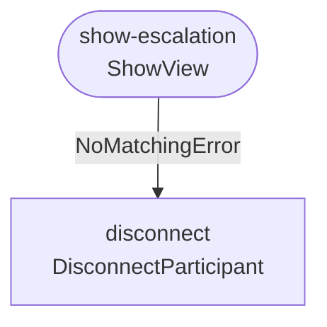

# HarborRidge311-EscalationGuide

```mermaid
flowchart TD
  n_show_escalation(["show-escalation<br/>ShowView"])
  n_disconnect["disconnect<br/>DisconnectParticipant"]
  n_show_escalation -->|"NoMatchingError"| n_disconnect
```
