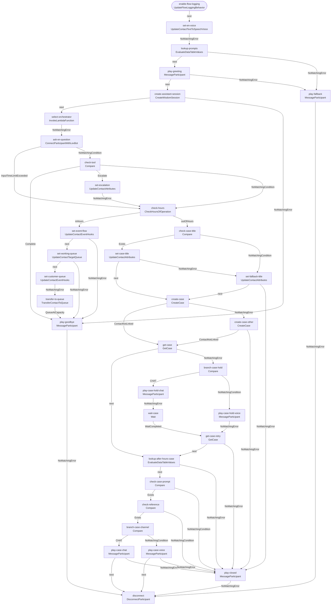

# HarborRidge311-Main

```mermaid
flowchart TD
  n_enable_flow_logging(["enable-flow-logging<br/>UpdateFlowLoggingBehavior"])
  n_set_en_voice["set-en-voice<br/>UpdateContactTextToSpeechVoice"]
  n_lookup_prompts["lookup-prompts<br/>EvaluateDataTableValues"]
  n_play_greeting["play-greeting<br/>MessageParticipant"]
  n_create_assistant_session["create-assistant-session<br/>CreateWisdomSession"]
  n_select_orchestrator["select-orchestrator<br/>InvokeLambdaFunction"]
  n_ask_en_question["ask-en-question<br/>ConnectParticipantWithLexBot"]
  n_check_tool["check-tool<br/>Compare"]
  n_set_escalation["set-escalation<br/>UpdateContactAttributes"]
  n_check_hours["check-hours<br/>CheckHoursOfOperation"]
  n_set_event_flow["set-event-flow<br/>UpdateContactEventHooks"]
  n_set_working_queue["set-working-queue<br/>UpdateContactTargetQueue"]
  n_set_customer_queue["set-customer-queue<br/>UpdateContactEventHooks"]
  n_transfer_to_queue["transfer-to-queue<br/>TransferContactToQueue"]
  n_check_case_title["check-case-title<br/>Compare"]
  n_set_case_title["set-case-title<br/>UpdateContactAttributes"]
  n_set_fallback_title["set-fallback-title<br/>UpdateContactAttributes"]
  n_create_case["create-case<br/>CreateCase"]
  n_create_case_other["create-case-other<br/>CreateCase"]
  n_get_case["get-case<br/>GetCase"]
  n_branch_case_hold["branch-case-hold<br/>Compare"]
  n_play_case_hold_chat["play-case-hold-chat<br/>MessageParticipant"]
  n_wait_case["wait-case<br/>Wait"]
  n_play_case_hold_voice["play-case-hold-voice<br/>MessageParticipant"]
  n_get_case_retry["get-case-retry<br/>GetCase"]
  n_lookup_after_hours_case["lookup-after-hours-case<br/>EvaluateDataTableValues"]
  n_check_case_prompt["check-case-prompt<br/>Compare"]
  n_check_reference["check-reference<br/>Compare"]
  n_branch_case_channel["branch-case-channel<br/>Compare"]
  n_play_case_chat["play-case-chat<br/>MessageParticipant"]
  n_play_case_voice["play-case-voice<br/>MessageParticipant"]
  n_play_closed["play-closed<br/>MessageParticipant"]
  n_play_goodbye["play-goodbye<br/>MessageParticipant"]
  n_play_fallback["play-fallback<br/>MessageParticipant"]
  n_disconnect["disconnect<br/>DisconnectParticipant"]
  n_enable_flow_logging -->|"next"| n_set_en_voice
  n_set_en_voice -->|"NoMatchingError"| n_lookup_prompts
  n_lookup_prompts -->|"next"| n_play_greeting
  n_lookup_prompts -->|"NoMatchingError"| n_play_fallback
  n_play_greeting -->|"next"| n_create_assistant_session
  n_play_greeting -->|"NoMatchingError"| n_play_fallback
  n_create_assistant_session -->|"next"| n_select_orchestrator
  n_create_assistant_session -->|"NoMatchingError"| n_play_goodbye
  n_select_orchestrator -->|"NoMatchingError"| n_ask_en_question
  n_ask_en_question -->|"InputTimeLimitExceeded"| n_check_hours
  n_ask_en_question -->|"NoMatchingCondition"| n_check_tool
  n_check_tool -->|"Complete"| n_play_goodbye
  n_check_tool -->|"Escalate"| n_set_escalation
  n_check_tool -->|"NoMatchingCondition"| n_check_hours
  n_set_escalation -->|"NoMatchingError"| n_check_hours
  n_check_hours -->|"inHours"| n_set_event_flow
  n_check_hours -->|"outOfHours"| n_check_case_title
  n_set_event_flow -->|"next"| n_set_working_queue
  n_set_event_flow -->|"NoMatchingError"| n_play_goodbye
  n_set_working_queue -->|"next"| n_set_customer_queue
  n_set_working_queue -->|"NoMatchingError"| n_play_goodbye
  n_set_customer_queue -->|"NoMatchingError"| n_transfer_to_queue
  n_transfer_to_queue -->|"QueueAtCapacity"| n_play_goodbye
  n_check_case_title -->|"Exists"| n_set_case_title
  n_check_case_title -->|"NoMatchingCondition"| n_set_fallback_title
  n_set_case_title -->|"next"| n_create_case
  n_set_case_title -->|"NoMatchingError"| n_set_fallback_title
  n_set_fallback_title -->|"next"| n_create_case
  n_set_fallback_title -->|"NoMatchingError"| n_play_closed
  n_create_case -->|"ContactNotLinked"| n_get_case
  n_create_case -->|"NoMatchingError"| n_create_case_other
  n_create_case_other -->|"ContactNotLinked"| n_get_case
  n_create_case_other -->|"NoMatchingError"| n_play_closed
  n_get_case -->|"next"| n_lookup_after_hours_case
  n_get_case -->|"NoMatchingError"| n_branch_case_hold
  n_branch_case_hold -->|"CHAT"| n_play_case_hold_chat
  n_branch_case_hold -->|"NoMatchingCondition"| n_play_case_hold_voice
  n_play_case_hold_chat -->|"NoMatchingError"| n_wait_case
  n_wait_case -->|"WaitCompleted"| n_get_case_retry
  n_play_case_hold_voice -->|"NoMatchingError"| n_get_case_retry
  n_get_case_retry -->|"next"| n_lookup_after_hours_case
  n_get_case_retry -->|"NoMatchingError"| n_play_closed
  n_lookup_after_hours_case -->|"next"| n_check_case_prompt
  n_lookup_after_hours_case -->|"NoMatchingError"| n_play_closed
  n_check_case_prompt -->|"Exists"| n_check_reference
  n_check_case_prompt -->|"NoMatchingCondition"| n_play_closed
  n_check_reference -->|"Exists"| n_branch_case_channel
  n_check_reference -->|"NoMatchingCondition"| n_play_closed
  n_branch_case_channel -->|"CHAT"| n_play_case_chat
  n_branch_case_channel -->|"NoMatchingCondition"| n_play_case_voice
  n_play_case_chat -->|"next"| n_disconnect
  n_play_case_chat -->|"NoMatchingError"| n_play_closed
  n_play_case_voice -->|"next"| n_disconnect
  n_play_case_voice -->|"NoMatchingError"| n_play_closed
  n_play_closed -->|"NoMatchingError"| n_disconnect
  n_play_goodbye -->|"NoMatchingError"| n_disconnect
  n_play_fallback -->|"NoMatchingError"| n_disconnect
```
