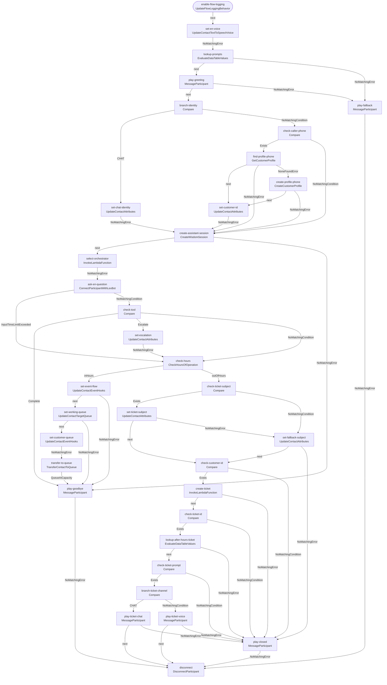

# HarborRidge311-Main

```mermaid
flowchart TD
  n_enable_flow_logging(["enable-flow-logging<br/>UpdateFlowLoggingBehavior"])
  n_set_en_voice["set-en-voice<br/>UpdateContactTextToSpeechVoice"]
  n_lookup_prompts["lookup-prompts<br/>EvaluateDataTableValues"]
  n_play_greeting["play-greeting<br/>MessageParticipant"]
  n_branch_identity["branch-identity<br/>Compare"]
  n_set_chat_identity["set-chat-identity<br/>UpdateContactAttributes"]
  n_check_caller_phone["check-caller-phone<br/>Compare"]
  n_find_profile_phone["find-profile-phone<br/>GetCustomerProfile"]
  n_create_profile_phone["create-profile-phone<br/>CreateCustomerProfile"]
  n_set_customer_id["set-customer-id<br/>UpdateContactAttributes"]
  n_create_assistant_session["create-assistant-session<br/>CreateWisdomSession"]
  n_select_orchestrator["select-orchestrator<br/>InvokeLambdaFunction"]
  n_ask_en_question["ask-en-question<br/>ConnectParticipantWithLexBot"]
  n_check_tool["check-tool<br/>Compare"]
  n_set_escalation["set-escalation<br/>UpdateContactAttributes"]
  n_check_hours["check-hours<br/>CheckHoursOfOperation"]
  n_set_event_flow["set-event-flow<br/>UpdateContactEventHooks"]
  n_set_working_queue["set-working-queue<br/>UpdateContactTargetQueue"]
  n_set_customer_queue["set-customer-queue<br/>UpdateContactEventHooks"]
  n_transfer_to_queue["transfer-to-queue<br/>TransferContactToQueue"]
  n_check_ticket_subject["check-ticket-subject<br/>Compare"]
  n_set_ticket_subject["set-ticket-subject<br/>UpdateContactAttributes"]
  n_set_fallback_subject["set-fallback-subject<br/>UpdateContactAttributes"]
  n_check_customer_id["check-customer-id<br/>Compare"]
  n_create_ticket["create-ticket<br/>InvokeLambdaFunction"]
  n_check_ticket_id["check-ticket-id<br/>Compare"]
  n_lookup_after_hours_ticket["lookup-after-hours-ticket<br/>EvaluateDataTableValues"]
  n_check_ticket_prompt["check-ticket-prompt<br/>Compare"]
  n_branch_ticket_channel["branch-ticket-channel<br/>Compare"]
  n_play_ticket_chat["play-ticket-chat<br/>MessageParticipant"]
  n_play_ticket_voice["play-ticket-voice<br/>MessageParticipant"]
  n_play_closed["play-closed<br/>MessageParticipant"]
  n_play_goodbye["play-goodbye<br/>MessageParticipant"]
  n_play_fallback["play-fallback<br/>MessageParticipant"]
  n_disconnect["disconnect<br/>DisconnectParticipant"]
  n_enable_flow_logging -->|"next"| n_set_en_voice
  n_set_en_voice -->|"NoMatchingError"| n_lookup_prompts
  n_lookup_prompts -->|"next"| n_play_greeting
  n_lookup_prompts -->|"NoMatchingError"| n_play_fallback
  n_play_greeting -->|"next"| n_branch_identity
  n_play_greeting -->|"NoMatchingError"| n_play_fallback
  n_branch_identity -->|"CHAT"| n_set_chat_identity
  n_branch_identity -->|"NoMatchingCondition"| n_check_caller_phone
  n_set_chat_identity -->|"NoMatchingError"| n_create_assistant_session
  n_check_caller_phone -->|"Exists"| n_find_profile_phone
  n_check_caller_phone -->|"NoMatchingCondition"| n_create_assistant_session
  n_find_profile_phone -->|"next"| n_set_customer_id
  n_find_profile_phone -->|"NoMatchingError"| n_create_assistant_session
  n_find_profile_phone -->|"NoneFoundError"| n_create_profile_phone
  n_create_profile_phone -->|"next"| n_set_customer_id
  n_create_profile_phone -->|"NoMatchingError"| n_create_assistant_session
  n_set_customer_id -->|"NoMatchingError"| n_create_assistant_session
  n_create_assistant_session -->|"next"| n_select_orchestrator
  n_create_assistant_session -->|"NoMatchingError"| n_play_goodbye
  n_select_orchestrator -->|"NoMatchingError"| n_ask_en_question
  n_ask_en_question -->|"InputTimeLimitExceeded"| n_check_hours
  n_ask_en_question -->|"NoMatchingCondition"| n_check_tool
  n_check_tool -->|"Complete"| n_play_goodbye
  n_check_tool -->|"Escalate"| n_set_escalation
  n_check_tool -->|"NoMatchingCondition"| n_check_hours
  n_set_escalation -->|"NoMatchingError"| n_check_hours
  n_check_hours -->|"inHours"| n_set_event_flow
  n_check_hours -->|"outOfHours"| n_check_ticket_subject
  n_set_event_flow -->|"next"| n_set_working_queue
  n_set_event_flow -->|"NoMatchingError"| n_play_goodbye
  n_set_working_queue -->|"next"| n_set_customer_queue
  n_set_working_queue -->|"NoMatchingError"| n_play_goodbye
  n_set_customer_queue -->|"NoMatchingError"| n_transfer_to_queue
  n_transfer_to_queue -->|"QueueAtCapacity"| n_play_goodbye
  n_check_ticket_subject -->|"Exists"| n_set_ticket_subject
  n_check_ticket_subject -->|"NoMatchingCondition"| n_set_fallback_subject
  n_set_ticket_subject -->|"next"| n_check_customer_id
  n_set_ticket_subject -->|"NoMatchingError"| n_set_fallback_subject
  n_set_fallback_subject -->|"next"| n_check_customer_id
  n_set_fallback_subject -->|"NoMatchingError"| n_play_closed
  n_check_customer_id -->|"Exists"| n_create_ticket
  n_check_customer_id -->|"NoMatchingCondition"| n_play_closed
  n_create_ticket -->|"next"| n_check_ticket_id
  n_create_ticket -->|"NoMatchingError"| n_play_closed
  n_check_ticket_id -->|"Exists"| n_lookup_after_hours_ticket
  n_check_ticket_id -->|"NoMatchingCondition"| n_play_closed
  n_lookup_after_hours_ticket -->|"next"| n_check_ticket_prompt
  n_lookup_after_hours_ticket -->|"NoMatchingError"| n_play_closed
  n_check_ticket_prompt -->|"Exists"| n_branch_ticket_channel
  n_check_ticket_prompt -->|"NoMatchingCondition"| n_play_closed
  n_branch_ticket_channel -->|"CHAT"| n_play_ticket_chat
  n_branch_ticket_channel -->|"NoMatchingCondition"| n_play_ticket_voice
  n_play_ticket_chat -->|"next"| n_disconnect
  n_play_ticket_chat -->|"NoMatchingError"| n_play_closed
  n_play_ticket_voice -->|"next"| n_disconnect
  n_play_ticket_voice -->|"NoMatchingError"| n_play_closed
  n_play_closed -->|"NoMatchingError"| n_disconnect
  n_play_goodbye -->|"NoMatchingError"| n_disconnect
  n_play_fallback -->|"NoMatchingError"| n_disconnect
```
