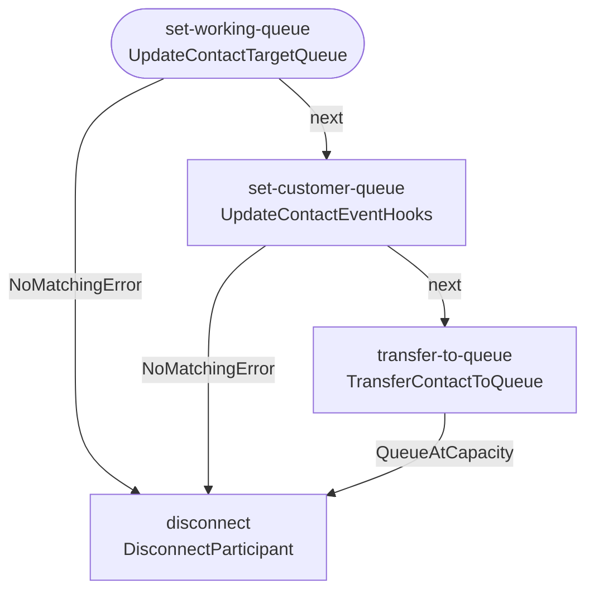

# HarborRidge311-MajorIncident

```mermaid
flowchart TD
  n_set_working_queue(["set-working-queue<br/>UpdateContactTargetQueue"])
  n_set_customer_queue["set-customer-queue<br/>UpdateContactEventHooks"]
  n_transfer_to_queue["transfer-to-queue<br/>TransferContactToQueue"]
  n_disconnect["disconnect<br/>DisconnectParticipant"]
  n_set_working_queue -->|"next"| n_set_customer_queue
  n_set_working_queue -->|"NoMatchingError"| n_disconnect
  n_set_customer_queue -->|"next"| n_transfer_to_queue
  n_set_customer_queue -->|"NoMatchingError"| n_disconnect
  n_transfer_to_queue -->|"QueueAtCapacity"| n_disconnect
```
