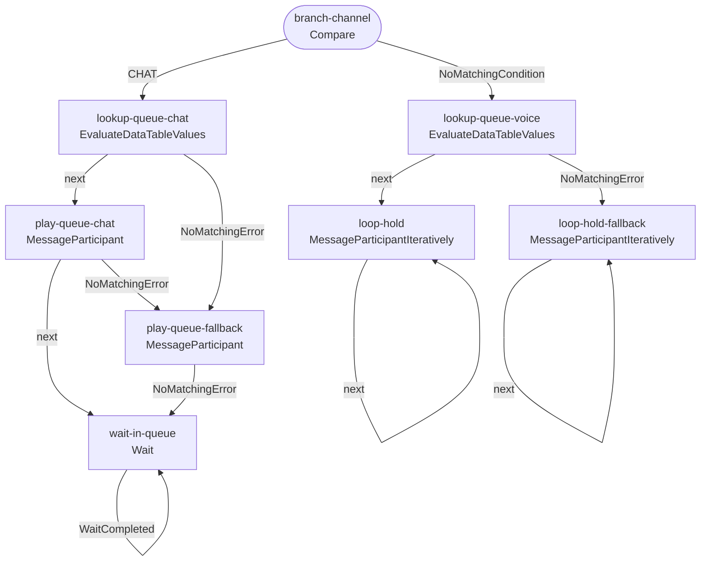

# HarborRidge311-Queue

```mermaid
flowchart TD
  n_branch_channel(["branch-channel<br/>Compare"])
  n_lookup_queue_chat["lookup-queue-chat<br/>EvaluateDataTableValues"]
  n_play_queue_chat["play-queue-chat<br/>MessageParticipant"]
  n_play_queue_fallback["play-queue-fallback<br/>MessageParticipant"]
  n_wait_in_queue["wait-in-queue<br/>Wait"]
  n_lookup_queue_voice["lookup-queue-voice<br/>EvaluateDataTableValues"]
  n_loop_hold["loop-hold<br/>MessageParticipantIteratively"]
  n_loop_hold_fallback["loop-hold-fallback<br/>MessageParticipantIteratively"]
  n_branch_channel -->|"CHAT"| n_lookup_queue_chat
  n_branch_channel -->|"NoMatchingCondition"| n_lookup_queue_voice
  n_lookup_queue_chat -->|"next"| n_play_queue_chat
  n_lookup_queue_chat -->|"NoMatchingError"| n_play_queue_fallback
  n_play_queue_chat -->|"next"| n_wait_in_queue
  n_play_queue_chat -->|"NoMatchingError"| n_play_queue_fallback
  n_play_queue_fallback -->|"NoMatchingError"| n_wait_in_queue
  n_wait_in_queue -->|"WaitCompleted"| n_wait_in_queue
  n_lookup_queue_voice -->|"next"| n_loop_hold
  n_lookup_queue_voice -->|"NoMatchingError"| n_loop_hold_fallback
  n_loop_hold -->|"next"| n_loop_hold
  n_loop_hold_fallback -->|"next"| n_loop_hold_fallback
```
